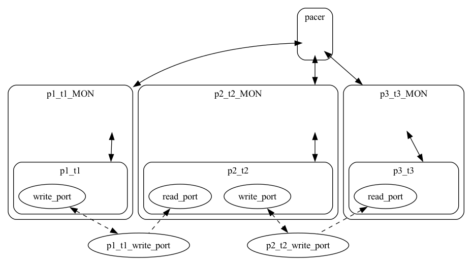

# Three Domain Model - Simple

## AADL Architecture


[AADL Model](aadl/test_data_port_periodic_three_domains.aadl)

## Codegen
1. Install [Docker Desktop](https://www.docker.com/products/docker-desktop/)

1. Clone this repo and cd into the ``case-tool-assessment-4/basic/test_data_port_periodic_three_domains_CASE-simple`` directory (i.e. the directory containing this readme)

   ```
   git clone https://github.com/santoslab/case-tool-assessment-4
   cd case-tool-assessment-4/basic/test_data_port_periodic_three_domains_CASE-simple
   ```

1. *OPTIONAL*

    If you want to rerun codegen then you will need to install Sireum
    and OSATE.  You can do this inside or outside of the container that you'll install in the next step (the latter is probably preferable as you could then use Sireum outside of the container).

    Copy/paste the following to install Sireum
    ```
    git clone https://github.com/sireum/kekinian.git
    kekinian/bin/build.cmd
    ```

    This installs/build Sireum from source rather than via a binary distribution (which is probably the prefered method for PROVERS).  

    Now set ``SIREUM_HOME`` to point to where you cloned kekinian and add ``$SIREUM_HOME/bin`` to your path.  E.g. for bash

    ```
    echo "export SIREUM_HOME=$(pwd)/kekinian" >> $HOME/.bashrc
    echo "export PATH=\$SIREUM_HOME/bin:\$PATH" >> $HOME/.bashrc
    source $HOME/.bashrc
    ```

    Now install OSATE and the Sireum OSATE plugins into your current directory (or wherever as indicated via the ``-o`` option).  For Windows/Linux 

    ```
    sireum hamr phantom -u -v -o $(pwd)/osate
    ```

    or for Mac copy/paste
    ```
    sireum hamr phantom -u -v -o $(pwd)/osate.app
    ```

    Now set ``OSATE_HOME`` to point to where you installed Osate

    ```
    echo "export OSATE_HOME=$(pwd)/osate" >> $HOME/.bashrc
    source $HOME/.bashrc
    ```

1. Download and run the Microkit docker container, mounting the ``case-tool-assessment-4/basic/test_data_port_periodic_three_domains_CASE-simple`` directory into

   ```
   docker run -it -w /root -v $(pwd):/root/test_data_port_periodic_three_domains_CASE-simple jasonbelt/microkit_domain_scheduling
   ```

   This container includes customized versions of Microkit and seL4 that support domain scheduling.  They were built off the following pull requests

   - [microkit #175](https://github.com/seL4/microkit/pull/175)
   - [seL4 #1308](https://github.com/seL4/seL4/pull/1308)

1. *OPTIONAL* Rerun codegen
   
    Launch the Slash script [aadl/bin/run-hamr.cmd](aadl/bin/run-hamr.cmd) from the command line.  This runs codegen on [top.impl](aadl/test_data_port_periodic_three_domains.aadl#L138) via OSATE and targets the Microkit platform.

   ```
   aadl/bin/run-hamr.cmd
   ```

1. Build and simulate the image

    Inside the container do the following

    ```
    export MICROKIT_BOARD=qemu_virt_aarch64
    export MICROKIT_SDK=/root/microkit/release/microkit-sdk-1.4.1-dev.14+cf88629
    cd /root/test_data_port_periodic_three_domains_CASE-simple/microkit
    make qemu
    ```

    You should get output similar to

    ```
    ...
    Booting all finished, dropped to user space
    MON|INFO: Microkit Bootstrap
    MON|INFO: bootinfo untyped list matches expected list
    MON|INFO: Number of bootstrap invocations: 0x00000009
    MON|INFO: Number of system invocations:    0x000000c4
    MON|INFO: completed bootstrap invocations
    MON|INFO: completed system invocations
    p1_t1: Init
    p2_t2: Init
    p3_t3: Init
    p1_t1: Sent 1
    p2_t2: Blocked 1
    p3_t3: Received: 0
    p1_t1: Sent 2
    p2_t2: Allowed 2
    p3_t3: Received: 2
    p1_t1: Sent 3
    p2_t2: Blocked 3
    p3_t3: Received: 2
    p1_t1: Sent 4
    p2_t2: Allowed 4
    p3_t3: Received: 4
    p1_t1: Sent 5
    p2_t2: Blocked 5
    p3_t3: Received: 4
    ```

    Enter ``Ctrl-A x`` to exit QEMU

## Relevant Microkit Artifacts

  - System Description - [microkit.system](microkit/microkit.system)

  - p1_t1
      - [Infastructure](microkit/components/p1_t1/src/p1_t1.c)
      - [User supplied behavior code](microkit/components/p1_t1/src/p1_t1_user.c) (initial version [here](microkit_initial/components/p1_t1/src/p1_t1_user.c))

   - p2_t2
      - [Infrastructure](microkit/components/p2_t2/src/p2_t2.c)
      - [User supplied behavior code](microkit/components/p2_t2/src/p2_t2_user.c) (initial version [here](microkit_initial/components/p2_t2/src/p2_t2_user.c))

  - p3_t3
      - [Infrastructure](microkit/components/p3_t3/src/p3_t3.c)
      - [User supplied behavior code](microkit/components/p3_t3/src/p3_t3_user.c) (intial version [here](microkit_initial/components/p3_t3/src/p3_t3_user.c))

## Microkit Architecture

