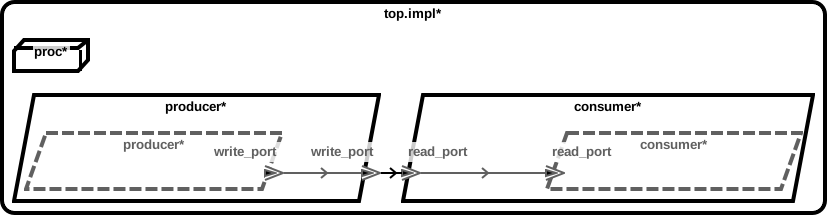
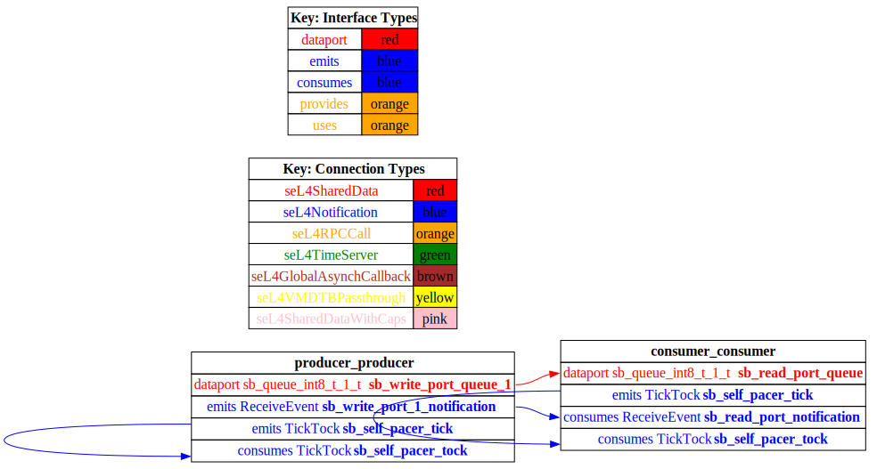
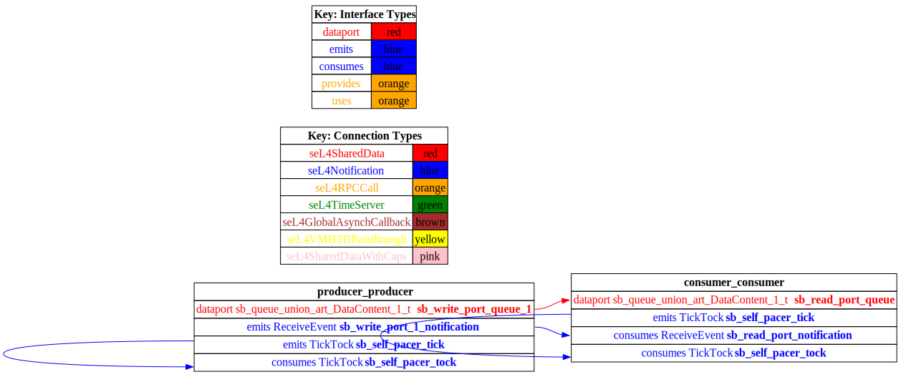

# <!--start__event-data-port-micro-example-title-->Event Data Port Micro-Example<!--end____event-data-port-micro-example-title-->
<!--start__event-data-port-micro-example-description-->
<!--end____event-data-port-micro-example-description-->
## <!--start__event-data-port-micro-example_arch-section-title-->AADL Architecture<!--end____event-data-port-micro-example_arch-section-title-->
<!--start__event-data-port-micro-example_arch-section-description-->

<!--end____event-data-port-micro-example_arch-section-description-->
<!--start__event-data-port-micro-example_arch-section_aadl-arch-component-info-top_impl_instance-->
|System: [test_event_data_port_periodic_domains::top.impl](aadl/test_event_data_port_periodic_domains.aadl#L85)|
|:--|
<!--end____event-data-port-micro-example_arch-section_aadl-arch-component-info-top_impl_instance-->
<!--start__event-data-port-micro-example_arch-section_aadl-arch-component-info-consumer-->
|Thread: consumer <!--[consumer](aadl/test_event_data_port_periodic_domains.aadl#L64)--> |
|:--|
|Type: [test_event_data_port_periodic_domains::consumer_t](aadl/test_event_data_port_periodic_domains.aadl#L42)<br>Implementation: [test_event_data_port_periodic_domains::consumer_t.i](aadl/test_event_data_port_periodic_domains.aadl#L51)|
|Native|
|Periodic: 1000 ms|
|Domain: 3|

<!--end____event-data-port-micro-example_arch-section_aadl-arch-component-info-consumer-->
<!--start__event-data-port-micro-example_arch-section_aadl-arch-component-info-producer-->
|Thread: producer <!--[producer](aadl/test_event_data_port_periodic_domains.aadl#L35)--> |
|:--|
|Type: [test_event_data_port_periodic_domains::producer_t](aadl/test_event_data_port_periodic_domains.aadl#L13)<br>Implementation: [test_event_data_port_periodic_domains::producer_t.i](aadl/test_event_data_port_periodic_domains.aadl#L22)|
|Native|
|Periodic: 1000 ms|
|Domain: 2|

<!--end____event-data-port-micro-example_arch-section_aadl-arch-component-info-producer-->
<!--start__event-data-port-micro-example_arch-section_aadl-arch-component-info-schedule-->
**Schedule:** [domain_schedule.c](aadl/domain_schedule.c)
<!--end____event-data-port-micro-example_arch-section_aadl-arch-component-info-schedule-->

## <!--start__event-data-port-micro-example_setup-title-->Setup the CAmkES Docker Container<!--end____event-data-port-micro-example_setup-title-->
<!--start__event-data-port-micro-example_setup-description-->
<!--end____event-data-port-micro-example_setup-description-->
<!--start__event-data-port-micro-example_setup_setup-block-->
You only need to perform these steps once for all the micro-examples in this
repository.

1. Install [Docker Desktop](https://www.docker.com/products/docker-desktop/)

1. Clone this repo and cd into it

   ```
   git clone https://github.com/santoslab/case-tool-assessment-4.git
   cd case-tool-assessment-4
   ```

1. Download and run the CAmkES docker container

   **NOTE**: Add the option `--platform linux/arm64` if on ARM

   ```
   docker run -it -w /root -v $(pwd):/root/case-tool-assessment-4 trustworthysystems/camkes
   ```

   Copy and paste the following into the container in order to fetch CAmkES, CAmkES-VM, and the Microkit SDK

   ```
   git config --global user.email ""
   git config --global user.name ""
   #
   (mkdir camkes && cd camkes && \
     repo init -u https://github.com/seL4/camkes-manifest.git && \
     repo sync)
   #
   (mkdir camkes-vm && cd camkes-vm && \
     repo init -u https://github.com/seL4/camkes-vm-examples-manifest.git && \
     repo sync)
   #
   (curl -L trustworthy.systems/Downloads/microkit_tutorial/sdk-linux-x64.tar.gz -o sdk.tar.gz && \
     tar xf sdk.tar.gz && mv sdk microkit_sdk && \
     echo "export MICROKIT_SDK=$(pwd)/microkit_sdk" >> $HOME/.bashrc)
   #
   source $HOME/.bashrc
   ```

1. *OPTIONAL*

    If you want to rerun codegen then you will need to install Sireum
    and OSATE into the container.

    Copy/paste the following into the container to install Sireum
    ```
    (DIR=$HOME/Sireum && export SIREUM_V=4.20240517.2ba56a5 && rm -fR $DIR && mkdir -p $DIR/bin && cd $DIR/bin && curl -JLso init.sh https://raw.githubusercontent.com/sireum/kekinian/$SIREUM_V/bin/init.sh && bash init.sh)
    echo "export SIREUM_HOME=$HOME/Sireum" >> $HOME/.bashrc
    echo "export PATH=\$SIREUM_HOME/bin:\$PATH" >> $HOME/.bashrc
    source $HOME/.bashrc
    ```

    Now copy/paste the following to install OSATE

    ```
    sireum hamr phantom -u -v -o $HOME/osate
    echo "export OSATE_HOME=$HOME/osate" >> $HOME/.bashrc
    source $HOME/.bashrc
    ```

    The following instructions related to rerunning HAMR Codegen assumes
    the ``SIREUM_HOME`` environmental variable has been set and that Sireum's
    ``bin`` directory has been added to the path. To verify a correct installation,
    run Sireum from the command line by typing ``sireum``. The output should indicate
    a build date of 4.20240508.f1c262c.
<!--end____event-data-port-micro-example_setup_setup-block-->

## <!--start__event-data-port-micro-example_sel4_only-title-->seL4_Only<!--end____event-data-port-micro-example_sel4_only-title-->
<!--start__event-data-port-micro-example_sel4_only-description-->
<!--end____event-data-port-micro-example_sel4_only-description-->
### <!--start__event-data-port-micro-example_sel4_only_sel4_only_behavior-title-->Behavior Code<!--end____event-data-port-micro-example_sel4_only_sel4_only_behavior-title-->
<!--start__event-data-port-micro-example_sel4_only_sel4_only_behavior-description-->
<!--end____event-data-port-micro-example_sel4_only_sel4_only_behavior-description-->
<!--start__event-data-port-micro-example_sel4_only_sel4_only_behavior_sel4_only_behavior_block-->
 - [producer.c](hamr/camkes-seL4_Only/components/producer_t_i_producer_producer/src/producer.c)
 - [consumer.c](hamr/camkes-seL4_Only/components/consumer_t_i_consumer_consumer/src/consumer.c)
<!--end____event-data-port-micro-example_sel4_only_sel4_only_behavior_sel4_only_behavior_block-->

### <!--start__event-data-port-micro-example_sel4_only_sel4_only_assembly-title-->CAmkES Assembly<!--end____event-data-port-micro-example_sel4_only_sel4_only_assembly-title-->
<!--start__event-data-port-micro-example_sel4_only_sel4_only_assembly-description-->
<!--end____event-data-port-micro-example_sel4_only_sel4_only_assembly-description-->
<!--start__event-data-port-micro-example_sel4_only_sel4_only_assembly_sel4_only_assembly_block-->
 - [top_impl_Instance.camkes](hamr/camkes-seL4_Only/top_impl_Instance.camkes)
<!--end____event-data-port-micro-example_sel4_only_sel4_only_assembly_sel4_only_assembly_block-->

### <!--start__event-data-port-micro-example_sel4_only_sel4_only_producer-title-->CAmkES Producer Artifacts<!--end____event-data-port-micro-example_sel4_only_sel4_only_producer-title-->
<!--start__event-data-port-micro-example_sel4_only_sel4_only_producer-description-->
<!--end____event-data-port-micro-example_sel4_only_sel4_only_producer-description-->
<!--start__event-data-port-micro-example_sel4_only_sel4_only_producer_sel4_only_producer_block-->
 - [CAmkES component](hamr/camkes-seL4_Only/components/producer_t_i_producer_producer/producer_t_i_producer_producer.camkes)
 - [Infrastructure Code](hamr/camkes-seL4_Only/components/producer_t_i_producer_producer/src/sb_producer_t_i.c)
<!--end____event-data-port-micro-example_sel4_only_sel4_only_producer_sel4_only_producer_block-->

### <!--start__event-data-port-micro-example_sel4_only_sel4_only_consumer-title-->CAmkES Consumer Artifacts<!--end____event-data-port-micro-example_sel4_only_sel4_only_consumer-title-->
<!--start__event-data-port-micro-example_sel4_only_sel4_only_consumer-description-->
<!--end____event-data-port-micro-example_sel4_only_sel4_only_consumer-description-->
<!--start__event-data-port-micro-example_sel4_only_sel4_only_consumer_sel4_only_consumer_block-->
 - [CAmkES component](hamr/camkes-seL4_Only/components/consumer_t_i_consumer_consumer/consumer_t_i_consumer_consumer.camkes)
 - [Infrastructure Code](hamr/camkes-seL4_Only/components/consumer_t_i_consumer_consumer/src/sb_consumer_t_i.c)
<!--end____event-data-port-micro-example_sel4_only_sel4_only_consumer_sel4_only_consumer_block-->

### <!--start__event-data-port-micro-example_sel4_only_sel4_only_shim-title-->Message Shim Code<!--end____event-data-port-micro-example_sel4_only_sel4_only_shim-title-->
<!--start__event-data-port-micro-example_sel4_only_sel4_only_shim-description-->
<!--end____event-data-port-micro-example_sel4_only_sel4_only_shim-description-->
<!--start__event-data-port-micro-example_sel4_only_sel4_only_shim_sel4_only_shim_block-->
 - [Event Counter](hamr/camkes-seL4_Only/types/includes/sb_event_counter.h)
<!--end____event-data-port-micro-example_sel4_only_sel4_only_shim_sel4_only_shim_block-->

### <!--start__event-data-port-micro-example_sel4_only_sel4_only-rerun-title-->How to build and run<!--end____event-data-port-micro-example_sel4_only_sel4_only-rerun-title-->
<!--start__event-data-port-micro-example_sel4_only_sel4_only-rerun-description-->
<!--end____event-data-port-micro-example_sel4_only_sel4_only-rerun-description-->
<!--start__event-data-port-micro-example_sel4_only_sel4_only-rerun_sel4_only-rerun-codegen-->
**OPTIONAL: Rerun Codegen**

```
/root/case-tool-assessment-4/basic/test_event_data_port_periodic_domains/aadl/bin/run-hamr.cmd seL4_Only
```
<!--end____event-data-port-micro-example_sel4_only_sel4_only-rerun_sel4_only-rerun-codegen-->
<!--start__event-data-port-micro-example_sel4_only_sel4_only-rerun_sel4_only-rerun-buildsim-->
**Build and simulate the system**

```
/root/case-tool-assessment-4/basic/test_event_data_port_periodic_domains/hamr/camkes-seL4_Only/bin/run-camkes.sh -c /root/camkes -s
```

Type ``CTRL`` + ``a`` then `x` to exit the QEMU simulation

<!--end____event-data-port-micro-example_sel4_only_sel4_only-rerun_sel4_only-rerun-buildsim-->

### <!--start__event-data-port-micro-example_sel4_only_sel4_only_camkesarch-title-->CAmkES Architecture<!--end____event-data-port-micro-example_sel4_only_sel4_only_camkesarch-title-->
<!--start__event-data-port-micro-example_sel4_only_sel4_only_camkesarch-description-->
<!--end____event-data-port-micro-example_sel4_only_sel4_only_camkesarch-description-->
<!--start__event-data-port-micro-example_sel4_only_sel4_only_camkesarch_sel4_only_camkesarch_block-->

<!--end____event-data-port-micro-example_sel4_only_sel4_only_camkesarch_sel4_only_camkesarch_block-->

## <!--start__event-data-port-micro-example_sel4-title-->seL4<!--end____event-data-port-micro-example_sel4-title-->
<!--start__event-data-port-micro-example_sel4-description-->
<!--end____event-data-port-micro-example_sel4-description-->
### <!--start__event-data-port-micro-example_sel4_sel4_behavior-title-->Behavior Code<!--end____event-data-port-micro-example_sel4_sel4_behavior-title-->
<!--start__event-data-port-micro-example_sel4_sel4_behavior-description-->
<!--end____event-data-port-micro-example_sel4_sel4_behavior-description-->
<!--start__event-data-port-micro-example_sel4_sel4_behavior_sel4_behavior_block-->
 - [producer_t_i_producer_producer.c](hamr/c/ext-c/producer_t_i_producer_producer/producer_t_i_producer_producer.c)
 - [consumer_t_i_consumer_consumer.c](hamr/c/ext-c/consumer_t_i_consumer_consumer/consumer_t_i_consumer_consumer.c)
<!--end____event-data-port-micro-example_sel4_sel4_behavior_sel4_behavior_block-->

### <!--start__event-data-port-micro-example_sel4_sel4_assembly-title-->CAmkES Assembly<!--end____event-data-port-micro-example_sel4_sel4_assembly-title-->
<!--start__event-data-port-micro-example_sel4_sel4_assembly-description-->
<!--end____event-data-port-micro-example_sel4_sel4_assembly-description-->
<!--start__event-data-port-micro-example_sel4_sel4_assembly_sel4_assembly_block-->
 - [top_impl_Instance.camkes](hamr/camkes-seL4/top_impl_Instance.camkes)
<!--end____event-data-port-micro-example_sel4_sel4_assembly_sel4_assembly_block-->

### <!--start__event-data-port-micro-example_sel4_sel4_producer-title-->CAmkES Producer Artifacts<!--end____event-data-port-micro-example_sel4_sel4_producer-title-->
<!--start__event-data-port-micro-example_sel4_sel4_producer-description-->
<!--end____event-data-port-micro-example_sel4_sel4_producer-description-->
<!--start__event-data-port-micro-example_sel4_sel4_producer_sel4_producer_block-->
 - [CAmkES component](hamr/camkes-seL4/components/producer_t_i_producer_producer/producer_t_i_producer_producer.camkes)
 - [Infrastructure Code](hamr/camkes-seL4/components/producer_t_i_producer_producer/src/sb_producer_t_i.c)
<!--end____event-data-port-micro-example_sel4_sel4_producer_sel4_producer_block-->

### <!--start__event-data-port-micro-example_sel4_sel4_consumer-title-->CAmkES Consumer Artifacts<!--end____event-data-port-micro-example_sel4_sel4_consumer-title-->
<!--start__event-data-port-micro-example_sel4_sel4_consumer-description-->
<!--end____event-data-port-micro-example_sel4_sel4_consumer-description-->
<!--start__event-data-port-micro-example_sel4_sel4_consumer_sel4_consumer_block-->
 - [CAmkES component](hamr/camkes-seL4/components/consumer_t_i_consumer_consumer/consumer_t_i_consumer_consumer.camkes)
 - [Infrastructure Code](hamr/camkes-seL4/components/consumer_t_i_consumer_consumer/src/sb_consumer_t_i.c)
<!--end____event-data-port-micro-example_sel4_sel4_consumer_sel4_consumer_block-->

### <!--start__event-data-port-micro-example_sel4_sel4_shim-title-->Message Shim Code<!--end____event-data-port-micro-example_sel4_sel4_shim-title-->
<!--start__event-data-port-micro-example_sel4_sel4_shim-description-->
<!--end____event-data-port-micro-example_sel4_sel4_shim-description-->
<!--start__event-data-port-micro-example_sel4_sel4_shim_sel4_shim_block-->
 - [Implementation](hamr/camkes-seL4/types/src/sb_queue_union_art_DataContent_1.c)
 - [Header](hamr/camkes-seL4/types/includes/sb_queue_union_art_DataContent_1.h)
 - [Event Counter](hamr/camkes-seL4/types/includes/sb_event_counter.h)
<!--end____event-data-port-micro-example_sel4_sel4_shim_sel4_shim_block-->

### <!--start__event-data-port-micro-example_sel4_sel4-rerun-title-->How to build and run<!--end____event-data-port-micro-example_sel4_sel4-rerun-title-->
<!--start__event-data-port-micro-example_sel4_sel4-rerun-description-->
<!--end____event-data-port-micro-example_sel4_sel4-rerun-description-->
<!--start__event-data-port-micro-example_sel4_sel4-rerun_sel4-rerun-codegen-->
**OPTIONAL: Rerun Codegen**

```
/root/case-tool-assessment-4/basic/test_event_data_port_periodic_domains/aadl/bin/run-hamr.cmd seL4
```
<!--end____event-data-port-micro-example_sel4_sel4-rerun_sel4-rerun-codegen-->
<!--start__event-data-port-micro-example_sel4_sel4-rerun_sel4-rerun-buildsim-->
**Build and simulate the system**

```
/root/case-tool-assessment-4/basic/test_event_data_port_periodic_domains/hamr/camkes-seL4/bin/run-camkes.sh -c /root/camkes -s
```

Type ``CTRL`` + ``a`` then `x` to exit the QEMU simulation

<!--end____event-data-port-micro-example_sel4_sel4-rerun_sel4-rerun-buildsim-->

### <!--start__event-data-port-micro-example_sel4_sel4_camkesarch-title-->CAmkES Architecture<!--end____event-data-port-micro-example_sel4_sel4_camkesarch-title-->
<!--start__event-data-port-micro-example_sel4_sel4_camkesarch-description-->
<!--end____event-data-port-micro-example_sel4_sel4_camkesarch-description-->
<!--start__event-data-port-micro-example_sel4_sel4_camkesarch_sel4_camkesarch_block-->

<!--end____event-data-port-micro-example_sel4_sel4_camkesarch_sel4_camkesarch_block-->
