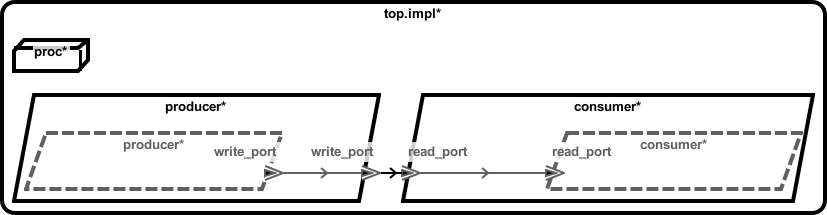

# <!--start__vm-micro-example-title-->VM Micro-Example<!--end____vm-micro-example-title-->
<!--start__vm-micro-example-description-->
<!--end____vm-micro-example-description-->
## <!--start__vm-micro-example_arch-section-title-->AADL Architecture<!--end____vm-micro-example_arch-section-title-->
<!--start__vm-micro-example_arch-section-description-->

<!--end____vm-micro-example_arch-section-description-->
<!--start__vm-micro-example_arch-section_aadl-arch-component-info-top_impl_instance-->
|System: [test_event_data_port_periodic_domains::top.impl](aadl/test_event_data_port_periodic_domains.aadl#L95)|
|:--|
|Wire Protocol|
<!--end____vm-micro-example_arch-section_aadl-arch-component-info-top_impl_instance-->
<!--start__vm-micro-example_arch-section_aadl-arch-component-info-consumer-->
|Thread: consumer <!--[consumer](aadl/test_event_data_port_periodic_domains.aadl#L63)--> |
|:--|
|Type: [test_event_data_port_periodic_domains::consumer_t](aadl/test_event_data_port_periodic_domains.aadl#L44)<br>Implementation: [test_event_data_port_periodic_domains::consumer_t.i](aadl/test_event_data_port_periodic_domains.aadl#L56)|
|Virtual Machine|
|Periodic: 1000 ms|
|Domain: 3|

<!--end____vm-micro-example_arch-section_aadl-arch-component-info-consumer-->
<!--start__vm-micro-example_arch-section_aadl-arch-component-info-producer-->
|Thread: producer <!--[producer](aadl/test_event_data_port_periodic_domains.aadl#L35)--> |
|:--|
|Type: [test_event_data_port_periodic_domains::producer_t](aadl/test_event_data_port_periodic_domains.aadl#L13)<br>Implementation: [test_event_data_port_periodic_domains::producer_t.i](aadl/test_event_data_port_periodic_domains.aadl#L25)|
|Native|
|Periodic: 1000 ms|
|Domain: 2|

<!--end____vm-micro-example_arch-section_aadl-arch-component-info-producer-->
<!--start__vm-micro-example_arch-section_aadl-arch-component-info-schedule-->
**Schedule:** [domain_schedule.c](aadl/domain_schedule.c)
<!--end____vm-micro-example_arch-section_aadl-arch-component-info-schedule-->

## <!--start__vm-micro-example_setup-title-->Setup the CAmkES Docker Container<!--end____vm-micro-example_setup-title-->
<!--start__vm-micro-example_setup-description-->
<!--end____vm-micro-example_setup-description-->
<!--start__vm-micro-example_setup_setup-block-->
You only need to perform these steps once for all the micro-examples in this
repository.

1. Install [Docker Desktop](https://www.docker.com/products/docker-desktop/)

1. Clone this repo and cd into it

   ```
   git clone https://github.com/santoslab/case-tool-assessment-4.git
   cd case-tool-assessment-4
   ```

1. Download and run the CAmkES docker container

   **NOTE**: Add the option `--platform linux/arm64` if on ARM

   ```
   docker run -it -w /root -v $(pwd):/root/case-tool-assessment-4 trustworthysystems/camkes
   ```

   Copy and paste the following into the container in order to fetch CAmkES, CAmkES-VM, and the Microkit SDK

   ```
   git config --global user.email ""
   git config --global user.name ""
   #
   (mkdir camkes && cd camkes && \
     repo init -u https://github.com/seL4/camkes-manifest.git && \
     repo sync)
   #
   (mkdir camkes-vm && cd camkes-vm && \
     repo init -u https://github.com/seL4/camkes-vm-examples-manifest.git && \
     repo sync)
   #
   (curl -L trustworthy.systems/Downloads/microkit_tutorial/sdk-linux-x64.tar.gz -o sdk.tar.gz && \
     tar xf sdk.tar.gz && mv sdk microkit_sdk && \
     echo "export MICROKIT_SDK=$(pwd)/microkit_sdk" >> $HOME/.bashrc)
   #
   source $HOME/.bashrc
   ```

1. *OPTIONAL*

    If you want to rerun codegen then you will need to install Sireum
    and OSATE into the container.

    Copy/paste the following into the container to install Sireum
    ```
    (DIR=$HOME/Sireum && export SIREUM_V=4.20240517.2ba56a5 && rm -fR $DIR && mkdir -p $DIR/bin && cd $DIR/bin && curl -JLso init.sh https://raw.githubusercontent.com/sireum/kekinian/$SIREUM_V/bin/init.sh && bash init.sh)
    echo "export SIREUM_HOME=$HOME/Sireum" >> $HOME/.bashrc
    echo "export PATH=\$SIREUM_HOME/bin:\$PATH" >> $HOME/.bashrc
    source $HOME/.bashrc
    ```

    Now copy/paste the following to install OSATE

    ```
    sireum hamr phantom -u -v -o $HOME/osate
    echo "export OSATE_HOME=$HOME/osate" >> $HOME/.bashrc
    source $HOME/.bashrc
    ```

    The following instructions related to rerunning HAMR Codegen assumes
    the ``SIREUM_HOME`` environmental variable has been set and that Sireum's
    ``bin`` directory has been added to the path. To verify a correct installation,
    run Sireum from the command line by typing ``sireum``. The output should indicate
    a build date of 4.20240508.f1c262c.
<!--end____vm-micro-example_setup_setup-block-->

## <!--start__vm-micro-example_vm-title-->seL4<!--end____vm-micro-example_vm-title-->
<!--start__vm-micro-example_vm-description-->
<!--end____vm-micro-example_vm-description-->
### <!--start__vm-micro-example_vm_vm_behavior-title-->Behavior Code<!--end____vm-micro-example_vm_vm_behavior-title-->
<!--start__vm-micro-example_vm_vm_behavior-description-->
<!--end____vm-micro-example_vm_vm_behavior-description-->
<!--start__vm-micro-example_vm_vm_behavior_vm_behavior_block-->
 - [producer_t_i_producer_producer.c](hamr/c/ext-c/producer_t_i_producer_producer/producer_t_i_producer_producer.c)
 - [vmconsumer.c](hamr/camkes-seL4/components/VM/apps/vmconsumer/vmconsumer.c)
<!--end____vm-micro-example_vm_vm_behavior_vm_behavior_block-->

### <!--start__vm-micro-example_vm_vm_assembly-title-->CAmkES Assembly<!--end____vm-micro-example_vm_vm_assembly-title-->
<!--start__vm-micro-example_vm_vm_assembly-description-->
<!--end____vm-micro-example_vm_vm_assembly-description-->
<!--start__vm-micro-example_vm_vm_assembly_vm_assembly_block-->
 - [top_impl_Instance.camkes](hamr/camkes-seL4/top_impl_Instance.camkes)
<!--end____vm-micro-example_vm_vm_assembly_vm_assembly_block-->

### <!--start__vm-micro-example_vm_vm_producer-title-->CAmkES Producer Artifacts<!--end____vm-micro-example_vm_vm_producer-title-->
<!--start__vm-micro-example_vm_vm_producer-description-->
<!--end____vm-micro-example_vm_vm_producer-description-->
<!--start__vm-micro-example_vm_vm_producer_vm_producer_block-->
 - [CAmkES component](hamr/camkes-seL4/components/producer_t_i_producer_producer/producer_t_i_producer_producer.camkes)
 - [Infrastructure Code](hamr/camkes-seL4/components/producer_t_i_producer_producer/src/sb_producer_t_i.c)
<!--end____vm-micro-example_vm_vm_producer_vm_producer_block-->

### <!--start__vm-micro-example_vm_vm_consumer-title-->CAmkES Consumer Artifacts<!--end____vm-micro-example_vm_vm_consumer-title-->
<!--start__vm-micro-example_vm_vm_consumer-description-->
<!--end____vm-micro-example_vm_vm_consumer-description-->
<!--start__vm-micro-example_vm_vm_consumer_vm_consumer_block-->
 - [CAmkES component](hamr/camkes-seL4/components/VM_consumer_p_i_consumer/VM_consumer_p_i_consumer.camkes)
 - *infrastructure and behavior code are combined for VMs*
<!--end____vm-micro-example_vm_vm_consumer_vm_consumer_block-->

### <!--start__vm-micro-example_vm_vm-rerun-title-->How to build and run<!--end____vm-micro-example_vm_vm-rerun-title-->
<!--start__vm-micro-example_vm_vm-rerun-description-->
<!--end____vm-micro-example_vm_vm-rerun-description-->
<!--start__vm-micro-example_vm_vm-rerun_vm-rerun-codegen-->
**OPTIONAL: Rerun Codegen**

```
/root/case-tool-assessment-4/vm/test_event_data_port_periodic_domains_VM/receiver_vm/aadl/bin/run-hamr.cmd seL4
```
<!--end____vm-micro-example_vm_vm-rerun_vm-rerun-codegen-->
<!--start__vm-micro-example_vm_vm-rerun_vm-rerun-buildsim-->
**Build and simulate the system**

```
/root/case-tool-assessment-4/vm/test_event_data_port_periodic_domains_VM/receiver_vm/hamr/camkes-seL4/bin/run-camkes.sh -c /root/camkes-vm -s
```

Type ``CTRL`` + ``a`` then `x` to exit the QEMU simulation

<!--end____vm-micro-example_vm_vm-rerun_vm-rerun-buildsim-->

**Note**: the above command will successfully build an image and then try to simulate it via

```
 qemu-system-aarch64 \
    -machine virt,virtualization=on,highmem=off,secure=off \
    -cpu cortex-a53 \
    -nographic -m size=2048 \
    -kernel /home/camkes-vm/build_camkes-seL4/images/capdl-loader-image-arm-qemu-arm-virt
```

however nothing happens. The new `simulate` python script generated by CAmkES instead uses qemu-system-arm with the cpu set to cortex-a15

```
qemu-system-arm \
    -machine virt,virtualization=on,highmem=off,secure=off 
    -cpu cortex-a15 \ 
    -nographic  -m size=2048 \
    -kernel /home/camkes-vm/build_camkes-seL4/images/capdl-loader-image-arm-qemu-arm-virt
```

This does make some progress, however it appears to get stuck at *Loading Kernel: 'linux'* stage below.  We haven't tried to simulate the VM examples for about 2 years so I'm not sure what it will take to resolve this.

```
...
Entering pre-init of producer_t_i_producer_producer
top_impl_Instance_producer_producer: base_test_event_data_port_periodic_domains_producer_t_i_producer_producer_initialise_ called
Leaving pre-init of producer_t_i_producer_producer
install_vm_devices@main.c:704 module name: map_frame_hack
install_vm_devices@main.c:704 module name: init_ram
install_vm_devices@main.c:704 module name: virtio_con
install_vm_devices@main.c:704 module name: cross_vm_connections
Loading Kernel: 'linux'
```

### <!--start__vm-micro-example_vm_vm_camkesarch-title-->CAmkES Architecture<!--end____vm-micro-example_vm_vm_camkesarch-title-->
<!--start__vm-micro-example_vm_vm_camkesarch-description-->
<!--end____vm-micro-example_vm_vm_camkesarch-description-->
<!--start__vm-micro-example_vm_vm_camkesarch_vm_camkesarch_block-->

<!--end____vm-micro-example_vm_vm_camkesarch_vm_camkesarch_block-->
